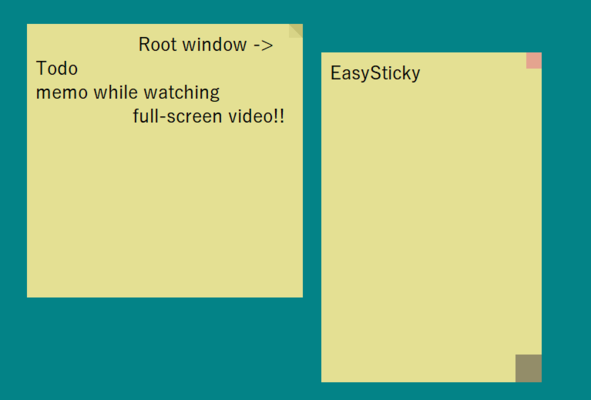

# EasySticky

Tkinterで作られた、軽量でシンプルな付箋メモアプリです。

複数ウィンドウ、常に手前に表示するモード、自動保存機能に対応しています。  
フルスクリーン動画を見ながらメモを取るのにも最適です！

---

## 🖼️ スクリーンショット




---

## ✨ 機能

- 枠のない付箋風のUI

- 複数のメモウィンドウ

- 最前面表示機能

- ドラッグによるウィンドウの移動・サイズ変更

- 自動保存・再起動時の復元

---

## 🚀 使い方

```bash
python main.py
```

---

## ⌨️ 操作方法

### キーボード

- **Ctrl + O**：ファイルを開く

- **Ctrl + S**：ファイルを保存

- **Ctrl + T**：常に手前に表示する／しないを切り替える

- **Ctrl + N**：新しいメモウィンドウを開く

- **Ctrl + Q**：ウィンドウを閉じる（ルートウィンドウの場合はアプリを終了）

- **Ctrl + Shift + H / Z**：すべてのウィンドウを表示（Windowsのみ）／非表示

### マウス

- **ドラッグ（テキストエリア）**：ウィンドウを移動

- **右下をドラッグ**：ウィンドウのサイズを変更

- **右上をクリック**：ウィンドウを閉じる

- **右クリック**：設定メニューを開く

- **URL上でControl + クリック**：リンクを開く

---

## 💾 自動保存

最初に開かれたウィンドウ（折り返された角が付いているウィンドウ）は、**ルートウィンドウ**として扱われます。

- `autosave_0.txt` に自動保存されます

- アプリの再起動時に自動的に復元されます

- 設定は `config.json` に自動保存されます

⚠️ **注意**

`autosave_0.txt` は手動で編集したり、別の内容を保存したりしないでください。  
このファイルは自動的に上書きされます。

---

## 📦 必要なもの

- Python 3.x

### 追加の依存ライブラリ

```bash
pip install keyboard
```

---

## 🛠️ 今後の予定

- ~~UIのカスタマイズ（色、フォント）~~

- ~~Linux版~~

- コントロールパネルの表示／非表示切り替え

- 自動保存の設定変更

---

## ⬇️ ダウンロード

最新バージョンは[Releasesページ](https://github.com/nycodesea/EasySticky/releases)からダウンロードできます。

---

## 📄 ライセンス

このプロジェクトはMITライセンスのもとで公開されています。
