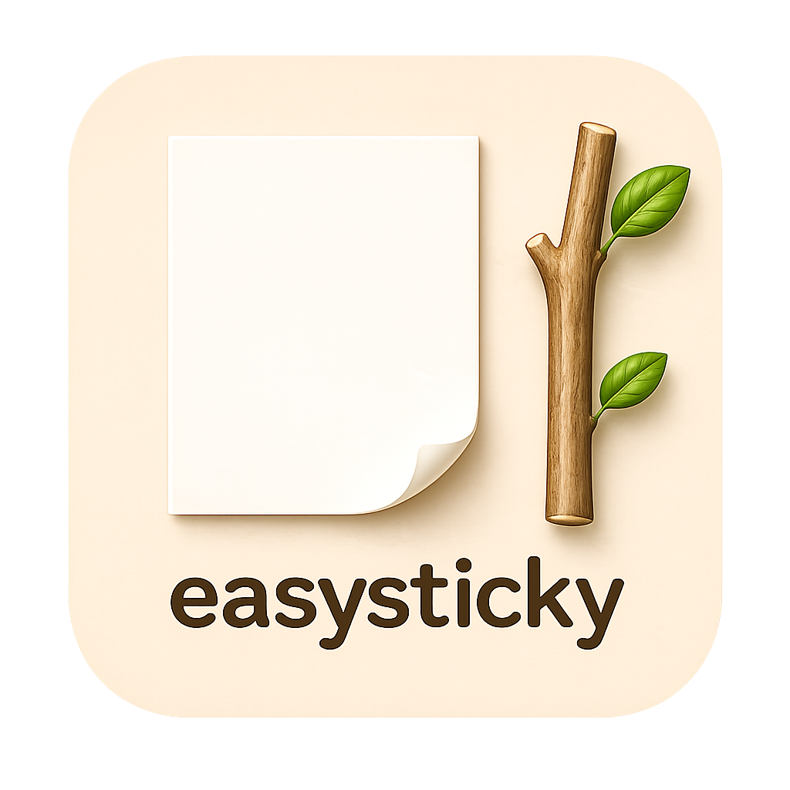

# EasySticky

A lightweight and simple sticky note app built with Tkinter.

Supports multiple windows, always-on-top mode, and auto-save functionality.  
Perfect for taking notes while watching full-screen videos!

---

## 🖼️ Screenshot




---

## ✨ Features

* Frameless sticky-note style UI
* Multiple memo windows
* Toggle always-on-top
* Drag to move and resize
* Auto-save with restore on restart

---

## 🚀 Usage

```bash
python main.py
```

---

## ⌨️ Controls

### Keyboard

* **Ctrl + O** : Open file
* **Ctrl + S** : Save file
* **Ctrl + T** : Toggle always-on-top
* **Ctrl + N** : Open new memo window
* **Ctrl + Q** : Close window (or exit app if root)
* **Ctrl + Shift + H / Z** : Show(Windows only) / Hide all windows

### Mouse

* **Drag (text area)** : Move window
* **Drag bottom-right** : Resize window
* **Click top-right** : Close window
* **Right Click** : Setting menu
* **Control - Click** on URL-text : Open link

---

## 💾 Auto Save

The first window opened (marked with a folded corner) is treated as a root window.

* Automatically saved to `autosave_0.txt`
* Restored when the app restarts
* Settings are automatically saved to `config.json`.

⚠️ **Warning**
Do not manually edit or save to `autosave_0.txt`, as it will be overwritten.

---

## 📦 Requirements

* Python 3.x

### Additional dependency

```bash
pip install keyboard
```

---

## 🛠️ Future Plans

* ~~UI customization (colors, fonts)~~
* ~~Linux version~~
* Toggle visibility of control panels
* Configurable auto-save
---

## ⬇️ Download

Download the latest version from the [Releases](https://github.com/nycodesea/EasySticky/releases) page:


---

## 📄 License

This project is licensed under the MIT License.


